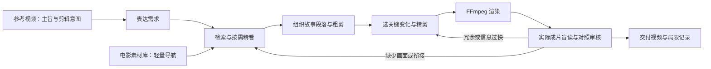

# Agentic Video

**给定参考视频，从更大的电影素材库中寻找画面，剪出表达相同主旨的新视频。**

Agentic Video 是一个参考驱动的自动剪辑研究原型。参考视频提供表达目标和剪辑意图；模型从已有电影素材中检索、观察和组合片段，形成新故事，再通过精剪和实际成片审阅改进表达。

我们希望观众从画面中看懂人物的处境、行动和结果，同时学习参考的关键瞬间选择、时间压缩、信息揭示和节奏安排。当前重点是电影素材库路线，使用 GLM 理解与决策，由本地程序校验并执行剪辑。

## 核心流程



这张图描述任务闭环；具体运行按已登记的阶段和停止条件执行，不无限重剪。

- **参考先确定目标。** 素材库提供实现目标的真实画面；不根据素材库擅自替换参考或弱化主旨。
- **段落可以重构。** 模型依据可用素材划分故事段落（slots），允许改变段落数量、顺序和具体情节，同时保持人物身份与事件联系。
- **观看围绕需求展开。** 稀疏画面用于导航，再精看有用区间和上下文，避免先把几小时素材全部精细描述一遍。
- **粗剪建立内容，精剪分配注意力。** 粗剪检查故事前后能否呼应；精剪保留关键变化、删掉冗余过程，为身份和结果留出看清的时间。目标时长接近参考，不一味追求最短。
- **检查真正输出的视频。** 先隐藏预设故事答案，静音描述实际可见内容，再对照目标；将字幕提供的信息与画面证据分开判断。音乐与声画节奏另行评价。

任务约定见 [参考驱动素材库规范](docs/REFERENCE_LIBRARY_SPEC.md)。

## 当前实现

| 部分 | 当前方式 |
| --- | --- |
| 视频理解与剪辑决策 | GLM-5.3-Flash，经当前 Codex 会话连接的官方视觉 MCP |
| 本地调度 | Python 管线、文件作业队列、落盘的请求与响应 |
| 素材观察 | 全局稀疏联系表、模型选择的连续片段、真实时间戳帧与局部密帧 |
| 剪辑执行 | FFmpeg 裁切、拼接、局部变速、字幕和真实尾帧停留；各阶段支持范围见实现文档 |
| 可选语言证据 | CPU `faster-whisper` small/int8，辅助理解对白 |
| 验证与恢复 | 文件 SHA、原片时间映射、观察范围校验、实际输出核查、缓存复用与失败留档 |

模型负责参考解释、检索需求、角色与段落选择、入出点和编辑表（EDL）；程序负责证据约束与执行。Codex 另有一次明确授权的教师示范，记录与自主 GLM 试验分开保存。

当前路径可以在本机运行，无需提前租服务器或购买 GPU。**它依赖有效的 Codex 官方 MCP 会话连接，尚不是一个可独立部署的 Coding Plan HTTP 服务。** 只运行 Python 命令并不能完成模型调用。

当前实测使用联系表和普通视频代理，**没有使用 FlashVID**；FlashVID 保留为后续粗看研究方案。代理的本地帧率不代表云端模型逐帧观看，云端内部采样策略尚未确认。ASR 也不能证明可见动作、人物身份或音乐节拍。

## 已完成的本地试验

截至 **2026-10-08**，电影库检索、粗剪和已有粗剪的精剪均已有真实运行记录。最新通用技能试验由 GLM 自主处理完整粗剪，完成一版候选及一次局部修订。

| 项目 | 实际结果 |
| --- | --- |
| 固定参考 | 21.93 秒 |
| 素材库 | 三部《功夫熊猫》，合计约 277.47 分钟 |
| 本次精剪输入 | 77.37 秒粗剪 |
| GLM 精剪交付 | 21.9 秒，1280×720、30 fps |
| 本次执行操作 | 9 段不连续素材，均为原速；结尾停留 0.4 秒 |
| 技术核验 | 交付画面与选中渲染逐帧一致；参考音轨按原速封装 |
| 内容与剪法评价 | 基本事件顺序可读；联合质量通过尚未建立 |

GLM 在这次试验中实现了关键片段选择和时间压缩，没有选择慢放或提速。虽然目标审核给出 `pass`，无字盲读仍是 `partial`；独立审阅发现学习过程、对手结果和部分画面因果缺口，文字仍承担部分含义。音乐卡点、声画艺术及陌生素材泛化也尚未通过验证。

因此，当前成果是**有真实视频与审阅证据的研究原型**，后续需要进一步验证叙事清晰度、关键边界和技巧迁移。

- [最新 GLM 试验：视频路径、实际剪法与审阅局限](docs/GLM_VISUAL_STORY_SKILL_TRIAL_20261008.md)
- [教师示范：完整思考、操作与复盘](docs/CODEX_TEACHER_FINECUT_20261008.md)
- [教师与 GLM：输入隔离及实际编辑表对照](docs/GLM_TEACHER_INPUT_COMPARISON_20261008.md)

最新交付在本机的完整路径如下；素材与运行视频不随代码上传。

```text
C:\Users\29785\Desktop\omni-autonomous-screenplay\runs\library_reference_20261004\artifacts\visual_story_skill_trial_v1\delivery\glm_skill_finecut.mp4
```

## 剪辑技能与知识

仓库包含两套通用技能，用于把剪辑判断拆成可观察、可执行和可复查的步骤。

| 技能 | 用途 |
| --- | --- |
| [visual-story-finecut](skills/visual-story-finecut/SKILL.md) | 完整粗剪的精炼：判断信息贡献、保留关键变化、按缺项补看、分配识别时间、审阅实际成片 |
| [glm-microclip-finecut](skills/glm-microclip-finecut/SKILL.md) | 小范围动作定位：真实时间戳帧、局部迭代观察、边界确认和实际短片核查 |
| [操作决策卡](skills/visual-story-finecut/references/decision-cards.md) | 判断何时使用省略、慢放、提速或停留，以及每种操作需要什么证据 |

技能提供通用方法。教师示范的电影剧情和具体切点不作为自主 GLM 试验的答案输入；接入技能本身也不代表模型已经掌握所有剪辑技巧。

## 本地准备

当前验证环境为 Windows、Python 3.13、Node.js/npm，`ffmpeg` 和 `ffprobe` 需在 PATH 中。Python 源码位于 `src/omni_story/`；开发时从仓库根目录以 editable 模式安装，CLI 和模块导入使用这份源码。运行所需知识卡与技能文本也随 wheel 打包；根目录 `skills/` 与 `craft_knowledge/` 保留供开发和技能维护使用。

```powershell
git clone https://github.com/Seven-creater/agentic-video.git
cd agentic-video
py -3.13 -m venv .venv-library
.\.venv-library\Scripts\python.exe -m pip install -e ".[library,test]"
.\.venv-library\Scripts\omni-library.exe --help
```

开发安装、三个 CLI 的本地检查、测试和 wheel 构建见 [开发说明](docs/DEVELOPMENT.md)；源码入口见 [代码地图](docs/CODE_MAP.md)。

输入通常放在：

```text
data/ref/video.mp4     # 固定参考视频
data/videos/          # 电影素材库
runs/                 # 本地请求、观察、编辑表、渲染与审阅记录
```

接通官方 MCP 和具体运行步骤见 [本地运行说明](docs/REFERENCE_LIBRARY_LOCAL_RUN.md)。该文包含早期运行快照，最新状态请以 [最新试验记录](docs/GLM_VISUAL_STORY_SKILL_TRIAL_20261008.md) 和原任务的授权记录为准。

恢复既有任务时复用已完成的结果，保留历史失败与来源记录；结果不明的模型请求不自动重发，不通过删除状态或更换目录重置任务。密钥通过环境或隐藏输入提供，不写入代码与命令行参数。

## 项目结构与路线

| 路径 | 内容 |
| --- | --- |
| `src/omni_story/` | Python 包源码；CLI 模块入口与共享媒体、后端逻辑 |
| `src/omni_story/library/` | 当前电影素材库管线、观察、精剪、渲染及恢复逻辑 |
| `skills/`、`craft_knowledge/` | 通用剪辑技能与决策知识 |
| `docs/` | 任务规范、文献调研、实现与实际实验记录 |
| `tests/` | 管线、证据校验、媒体执行与恢复测试 |
| `scripts/`、`.github/workflows/` | 无模型安装检查与 Windows / Linux 持续集成 |
| `src/omni_story/discovery/` | 已冻结的 Qwen 抖音参考发现路线 |
| `src/omni_story/` 其他模块 | 已冻结的 Omni / MiniMax 生成素材路线 |
| `data/`、`runs/` | 本地媒体及运行产物，Git 忽略 |

当前开发围绕参考驱动的素材库剪辑。抖音发现与 MiniMax 生成路线保留代码和历史，不作为当前默认流程启动。

继续开发前可阅读 [HANDOFF.md](HANDOFF.md) 与 [AGENTS.md](AGENTS.md)。研究依据见 [端到端研究](docs/REFERENCE_LIBRARY_RESEARCH_20261004.md)、[剪辑技巧研究](docs/EDITING_TECHNIQUE_RESEARCH_20261004.md) 和 [参考时间压缩研究](docs/REFERENCE_TIME_COMPRESSION_20261004.md)。

此前 README 中的详细进度、失败和旧路线命令已保存在 [历史 README 快照](docs/README_HISTORY_20261008.md)，供追溯。
