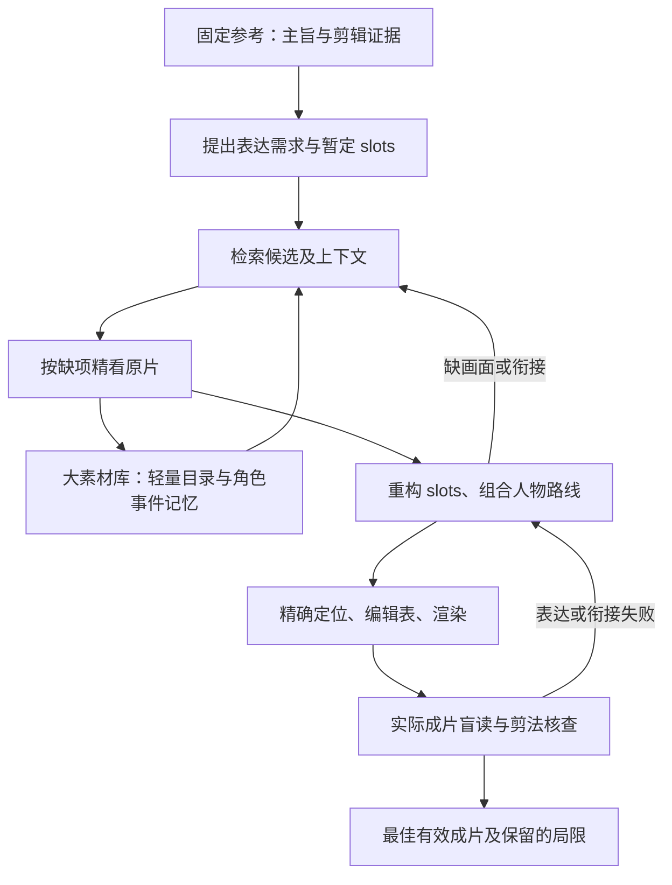

# 参考驱动的电影素材库剪辑：任务约定

最新修订（2026-10-05）：用户进一步确认render_0的77.37秒版才是粗剪，
render_3的34秒版已属于精剪候选；前一条将34秒称为粗剪的接受记录保留为历史。
当前先实现逐slot精剪代码，后续分别处理这两版并比较效果；重要身份／结果
看不清时允许加长，不能全片统一压缩。GLM自主划slot、选瞬间和变速，
Codex提供通用知识与证据校验，不指定电影入出点。
见[任务与调研](ROUGH_TO_FINE_SLOT_RESEARCH_20261005.md)、
[双父视频精剪实现](SLOT_FINECUT_IMPLEMENTATION_20261005.md)。
本轮授权代码与合成测试，Goal仍暂停；未启动新GLM调用或真实影片渲染。

确认日期：2026-10-04，Asia/Shanghai。本文记录用户最新任务定义，供后续工程和新聊天窗口优先阅读。

当前用户授权一次完整参考自主观察与精切事实闭环，见
[实际续跑与证据边界](REFERENCE_LIBRARY_SEMANTIC_RUN_20261004.md)。整条参考的重要位置由
GLM 自主判断，不指定用户举例的秒数；旧解释不作为新参考输入。原预算和输入锁保留。
下方修订成片是前一版本的历史结果，不代表新续跑已经完成。

最新实施结果见 [授权修订运行报告](REFERENCE_LIBRARY_REVISION_20261004.md)。原任务内完成第三版
34 秒成片，GLM 自主选片与剪辑，当前累计 58 次请求。该次新增渲染有单独的用户授权；
原输入锁、旧结果、不明请求和 16 个唯一精看窗口边界保留。模型评分为 pass，独立核对仍有
语义描述和音频局限；不将工程完成写成陌生观众或声画节奏验收通过。

## 任务定义与优先级

给定一条或少量参考视频，从明显更大的电影素材库中检索、观察、组织和剪辑真实片段，输出可播放、能表达参考主旨并迁移其剪辑方法的新视频。初期调研曾考虑一至两部国产动画；同日用户提供实际输入后，首轮库确定为本地三部《功夫熊猫》，见本文末尾的实施追加记录。

**参考先确定创作目标，素材库提供实现目标的画面。** 用户后来明确修正了此前“根据素材库主题寻找参考”的设想：该设想作为历史保留，不再作为当前搜索方向或验收前提。若保留 Qwen 抖音发现模块，它独立寻找满足创作目标的参考，不为迎合当前素材库而改选参考。

旧 MiniMax 生成素材路线按用户要求保持冻结。新路线使用已有电影片段，不自动启动旧付费生成、重新提交旧任务或改写其历史记录。本文初次调研时仅有文档，检索、角色事件索引和基于素材的 slot 重构尚未实现；用户随后授权实施与运行，当前进展单独追加，不追溯改写研究结论或旧运行。

## 用户已确认的创作要求

1. 参考的**主旨内容必须保留**。应写清希望观众理解的关系、行动与结果；不能仅以相同情绪、关键词或视觉相似证明主旨相同。
2. 故事结构、slot 数量、段落顺序和具体情节可以依据实际素材改变，不锁死参考的三段式、镜头数或秒点。片段选择与 slot 重构反复交互，不能先写一份不可修改的完整剧本再强找素材。
3. 焦点人物身份保持一致。可以使用主角，也可以使用其他角色；场景可以变化。连续性包括外形阶段、道具、身体状态、事件前提和可见结果，不能仅靠同一角色名字判断成立。
4. 新视频应能通过画面让观众理解内容。素材对白可以帮助系统理解；不能靠额外编写解释、字幕或旁白掩盖关键画面证据缺失。后续若改变此创作范围，应单独记录。
5. 参考和素材库应为异源，排除来自同一电影的混剪、预告、转载及局部重用。来源不明要记录为待核验，不能自动宣称已排除泄露。
6. 学习参考的镜头组织、信息揭示、节奏、声画关系及必要的卡点。迁移需要实际执行与成片证据，不能以模型解释或编辑表行数代替。
7. 创作与选片由模型自主完成。基础设施、预算和素材库路径可由用户提供；Codex 不手写本条参考的剧情、不代选片段、不在运行中人工修改答案。

## 2026-10-04 追加：画面叙事是内容验收核心

用户进一步说明：参考没有说话声，只有 BGM；核心要求是通过观察画面理解准确内容。
后续内容验收采用 `visual_narrative_primary_v1`：静音观看实际成片，隐藏剧本、素材说明和
预设的主旨答案，先独立描述观众实际能理解的事件，再与参考主旨比较。

内容审核应逐项回答，并给出实际输出时间区间和可见证据：

- 焦点人物遇到什么处境或困难，哪些画面建立了它？
- 人物采取了什么行动，前后状态和结果是否能看见？
- 镜头之间能否建立合理的关系，是否存在缺失转折、人物混淆或靠猜测补出的因果？
- 看完实际成片能理解什么主旨，它与参考的表达目标是否一致？

没有听到音频本身，不构成画面叙事审核失败。BGM 的作用、节奏和卡点仍可单独评估，
但不能与内容是否可读混为一项，也不因音乐未核验就否定已经有画面证据的叙事。
字幕可以辅助表达；审核须区分可见动作／镜头关系与文字提供的信息，不能用解释文字
掩盖关键画面证据缺失。带字幕的盲读不自动证明去掉字幕后仍然看得懂。

该澄清记录用户的内容标准，不追溯更改旧提示、旧模型评分、音频测量或未核验 ASR。
旧 ASR 和模型对音轨的解释不能代替实际声音核验，也不能作为必须依赖对白的创作理由。
当前仅追加任务约定，尚未将该版本接入运行提示或重新评审既有成片；没有新增模型调用或渲染授权。

## 素材知识与观察方式

- 电影常识、联网资料及影片简介可辅助库内导航，但与当前文件的实际观察分别保存。没有看片证据的具体事件、角色状态和时间区间不能作为已验证素材。
- 可提前建立与任务无关的轻量目录：文件、原时间、镜头、场景、角色候选、可见事件、对白。它不用于决定参考搜索方向。
- 角色索引关联共享事件。例如 A 救 B、C 旁观，事件只保存一次，各角色关联不同作用；不能重复建三个相互矛盾的事件版本。
- 长期记忆保存“看见了什么”和出处；任务记忆保存“本次可用于表达什么”。微笑、奔跑、战斗等素材的表达用途依赖组合上下文，不能提前贴死。
- FlashVID 的约 0.10 视觉 token 保留作为粗看候选方法。它不是云 API 参数，不代表全链成本剩十分之一，也不保证人物、短动作或切点无损。只在真正使用对应本地插件时声称使用了该方法。
- 查询驱动精看原片连续区间，并保留邻近事件。粗索引未命中是“未发现”；只有记录覆盖范围和检查方式后，才可以陈述某种范围内未找到。
- 用户接受用本地小模型 ASR 补充带时间戳台词。ASR 不等同于音乐节拍、音效、表演语气或可见人物身份识别。模型迁移仍需单独验证，不在此文中承诺 GLM 已替代现有代码。

## 闭环与结果边界

参考在单次任务内保持固定；素材反馈可以改变实现方案，不能擅自换参考、弱化主旨或凭空补事件。预算内优先寻找证据、补上下文、重划 slots 或改用库内另一条角色路线。

每个选入片段绑定实际原文件、SHA、原时间区间和观察证据；代理播放时间、抽帧编号或粗看时间估计不能直接作为原片切点。精确裁切前需确认原时间映射。

预算耗尽后可以交付实际有效的最佳候选及局限。必须区分技术有效、表达待核验、主旨成立、剪法迁移部分成立等状态。可播放但主旨不成立的片子不能标为任务成功；没有足够有效素材时保留失败结果和检索证据，不编造成功。

模型对实际成片的审核不是观众真值。评测中的人工标注或陌生观众盲评属于研究评估，不是运行时人工编剧或选片。

## 防止后续漂移

后续工程先读本文，再读 [端到端调研](REFERENCE_LIBRARY_RESEARCH_20261004.md)。任务约定、方案建议、文献支持和本项目实测四种信息应明确区分。

新配置、索引、模型、提示词、素材版本和预算应有独立版本与来源记录。不能把新的规则追溯写进旧运行，不通过新目录清空请求预算，不自动重放结果不明的付费请求。

初次调研时，素材文件、参考集合、新模型组合、粗看采样参数和阶段预算尚未确定。下方同日实施记录列出本次实际输入与冻结配置；其他候选方案仍不能冒充本次已实现功能。

## 2026-10-04 追加：实际输入后的实施约定

用户已授权实现并实际跑新路线。固定参考为仓库 `data/ref/video.mp4`，21.933333 秒；
固定素材目录为 `data/videos/`，三部《功夫熊猫》合计 277.4704 分钟。
参考与库原件均绑定 SHA；本次不用电影题材反向更换参考。

当前实现使用 `glm-5.3-flash` 官方视觉 MCP，在 Codex 支持的会话内连接；独立 Python CLI
通过本地文件队列交换 MCP 作业，不将 Coding Plan 包装成独立后台模型 API。
CPU `faster-whisper` small/int8 作为 ASR，FFmpeg 处理联系图、精看片段和渲染。
无需租服务器；没有启动本地 FlashVID GPU 插件，也未调用旧 MiniMax 生成素材。
完整操作见 [本地运行指南](REFERENCE_LIBRARY_LOCAL_RUN.md)。

首轮参数已锁在 `runs/library_reference_20261004/library_state.json`：每 600 秒取 18 张粗看帧，
三部片共 30 页；最多 16 个精看窗口、2 轮计划／成片、80 次模型请求（含修复）。
这些参数是首轮实施配置，不证明采样足以覆盖全部角色事件；稀疏帧间内容仍是未观察。
电影国语音轨由实际元数据绑定为全局 stream index 2；参考的音轨为 index 0。

模型决定主题理解、检索窗口、角色路线、slots、实际源入出点及音频策略。
程序只接受完成精看并有原时间证据的片段，按源 PTS 秒裁切后转换输出帧率，
支持 fit/crop、none/grayscale、0.5–2 倍速以及 source/reference/mix/silent。
J/L cut、自动分离人声和音乐、字幕／旁白生成目前不在已实现能力内。

当前 run 恢复使用同一目录及同一注册记录；不通过新目录重置预算。
已知 HTTP 回复可以作为追加证据核对并恢复其明确结果，但不能抹去原失败分类；
结果不明的提交禁止重放，格式失败最多一次新协议修复，计入原预算。

写此追加记录时，真实参考理解完成；首张电影粗看响应 HTTP 200，8,192 输出 token 耗尽且无可用 content，
原响应与消耗已保存，一次协议修复正在进行。**没有完成素材库成片，也没有完成端到端验收。**
后续结果应依据实际 `result.json`、成片 SHA、盲读及审阅记录追加，不能提前将候选代码能力写成成功实验。

## 2026-10-04 再追加：独立输入续跑和 adaptive_coarse_v2

前一段的首粗看协议修复已经成功（`glm_003`），该成功不覆盖原 8,192 token 耗尽的响应。
后续 `glm_004` 约 306 秒后 `fetch failed` 且无捕获回复，保留 `uncertain` 历史和一次请求预算占用。
不得重放原摘要、原媒体 SHA 或相同 `kind/source_sha256/source_start_s/source_end_s` lineage；
重编码、改文件名或改提示不能使原观察变成新独立输入。

按用户禁止重放的规则继续其他独立工作，当前 run 单独追加
`independent_media_no_unknown_replay_v1`，不改原输入锁、政策版本和累计预算。
在途 `submitted` 仍需等待；未启用追加政策时，基础 state 的保守规则仍阻断未知请求后的继续提交。

原固定 30 页网格没有作为完整观察验收，当前使用 `adaptive_coarse_v2`：

1. 三部电影各抽取 18 个带原时间标签的全局导航帧。
2. GLM 根据固定参考与这些实际证据，在全库自主选择最多 4 个、不超过 600 秒的区域进一步粗看。
3. 根据具体缺项每轮最多选择 8 个、不超过 90 秒的连续精看窗口；总硬上限仍为 16 个。
4. 两轮最多 2 个实际成片，80 次模型请求总硬上限与历史请求计数不变。

全局帧和区域抽样不是完整电影观看；未观察内容仍不作为事实。已有明确结果可复用，
004 对应不明观察不能重新提交，也不能把未知内容拼进“已看完”的索引。

官方 MCP 的进程配置使用 16,384 输出 token 和 600 秒 timeout，本地 Node dispatcher 使用
`undici@7.16.0`、headers/body 各 600 秒，内部重试仍阻断；并未改写官方模型请求 body。
默认五分钟 header timeout 是 004 失败的候选原因，原 cause 未捕获，不声称已确定根因。

本次追加写入时 005、006 概览已收到，007 正在提交中；**尚无素材库成片**。
