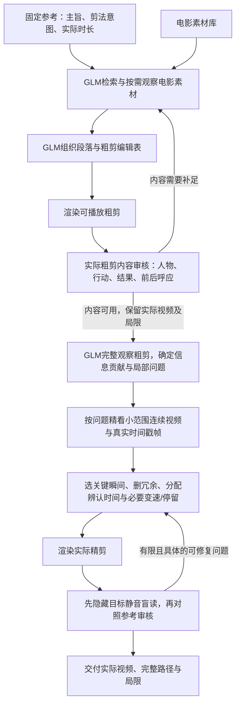

# 同一条粗剪 → 精剪流水线：历史回顾与当前约定

2026-10-09，Asia/Shanghai。用户要求回顾当前对话，并再次明确：
**GLM先完成粗剪，紧接着精剪；这是同一条自动流水线。**
本文核对本轮可见对话、既有实验文档、原始请求/编辑表与实际视频SHA，
记录当前约定，不将实现中的不同入口解释成不同业务路线。
它没有启动模型、恢复任务、改写旧回复或生成视频。

## 当前任务与阶段交接

固定参考决定主旨与剪辑意图；电影素材库提供实际画面。
GLM自主理解、检索、划分段落、选择角色与切点，程序校验并执行。
MiniMax生成与Qwen抖音发现保留为冻结历史。当前实测没有FlashVID。



图中的反馈按任务登记的有限阶段执行，不无限重剪。
不要求人工批准每个slot或提供剧情答案。历史用户接受某条粗剪，是样例分类与任务指导；
独立运行时仍需GLM审核实际粗剪，不把用户当作流水线里的手工剪辑节点。

- **粗剪建立内容。** 先让人物路线、行动和结果、段落前后呼应成立。
  77秒是当前样例时长，不是所有任务固定77秒，也不把34秒自动当作粗剪。
  粗剪不承担接近参考长度的精炼目标。
- **精剪读取真实粗剪。** 输入是粗剪MP4、来源映射、GLM自身的内容认识、
  参考目标及通用skill。粗剪JSON不能替代实际粗剪观看。
- **整体与局部共同决定。** 先看整片，再按缺项看小范围；局部剪法要放回前后关系。
  slot数量和具体事件可根据素材调整，不能把参考故事结构或某条样例的五个slot写死。
- **精剪接近参考时长。** 用户明确不追求越短越好。重要身份、结果和反应太快可加长；
  省略其他冗余以分配时间。参考当前约21.93秒，目标不能被模型改成150秒。
- **技巧服务表达。** 不连续关键瞬间、晚入早出、动作/反应组接、局部慢放、加速和真实停留
  均可按实际证据选择，不要求每段都变速。只用技巧不证明精炼有效。
- **画面优先。** 参考只有BGM，不能以没听到对白判叙事失败。
  审核区分画面、文字与推断；字幕不能补出没有展示的行动或结果。

## 对话中真正改变了后续任务的节点

| 记录与用户修正 | 实际结果 | 对当前流程的约束 |
| --- | --- | --- |
| 参考优先：纠正“素材库决定找什么参考” | 固定参考、三部电影成为当前输入 | 素材反馈可以改实现方式，不能擅自换参考或弱化主旨 |
| GLM电影库首轮，2026-10-04 | 渲染77.366667秒与64秒，选77秒；主旨/剪法partial、连续性pass | 已有可播放内容基线，模型评分不等于完整质量通过 |
| 用户先认可34秒内容，随后修正粗剪分类 | 明确77秒是粗剪，34秒是已有精剪候选 | 后续精剪真实父视频，不能反复从电影库重写整片草稿 |
| 对34秒与77秒并行精剪，2026-10-06 | 34→31秒，77→76.2秒 | 有变速/停留但精炼不足；76.2秒模型pass不能当成功标准 |
| 小范围迭代抽帧试验，2026-10-07 | 首个15秒slot→1.3秒，必要上下文和落地丢失；v2后续仍未出新片 | 小范围观察是按需工具，不能把整段精剪锁成单动作或单组三锚点 |
| 用户要求Codex做教师示范，并将15秒改为完整77秒 | 教师最终21.866667秒，蒸馏通用skill/决策卡 | 教师电影EDL是本次示范，不作为GLM自主测试的答案 |
| 用户澄清接近参考时长即可，再要求技能迁移给GLM，2026-10-08 | GLM77.37→21.9秒，实际一版加一次局部改版 | 复用完整粗剪观察→局部补看→完整EDL→实际审看这个顺序 |
| 独立Ubuntu部署及测试，2026-10-09 | 当前35次均received，0渲染；152秒只是一份计划 | 部署应衔接同一流水线；当前默认入口尚未完整接好两阶段 |
| 本轮再次澄清“一条线，粗剪紧接精剪” | 新恢复修改未提交、未部署、未登记或启动 | 先回顾并收敛主流程，不继续堆叠恢复分支 |

前几次局部/逐段失败是探索记录，不是当前默认处理路线。
80次历史预算、Goal和未知请求是旧实验边界；当前服务器无80总上限，但仍有有限阶段、
每阶段唯一修复与无进展停止，不能把不限总调用理解成无限循环。

## 已经完成过的77秒 → 21.9秒过程

1. 原电影库任务由GLM自主产出并实际渲染77.366667秒的 `render_0/final.mp4`。
   后来用户把它确定为粗剪基线。原模型partial评分及画面局限保留。
2. 技能试验将这份MP4绑定为父视频，按原速生成完整静音观察代理；只处理空间黑边，
   没有预选教师时间范围。
3. 给GLM通用 `visual-story-finecut/SKILL.md` 与 `decision-cards.md`。
   GLM完整观察父片，生成五项信息贡献并自己选择四处局部问题。
4. 自选粗剪范围5–9、38–41.5、41.5–45、54–58秒，分别提供连续短片和真实PTS图片页。
   这些具体范围是本次模型决定的历史结果，不能固化为下一条视频的预设裁点。
   粗观察曾误读训练，图片补看改正了部分描述；模型收到视频不证明逐帧理解。
5. GLM提出完整精剪表。验证使用真实参考目标21.933333秒、登记容差±2秒，
   按帧编译时长；配原参考音乐时额外要求画面能落入音轨时长。
6. 实际渲染、去字幕静音盲读、目标比较。GLM根据实际输出反馈做唯一局部改版，
   再完成同样的实际输出审阅；没有无限轮次。
7. 最终交付21.9秒、657帧。九段均1×，末段0.4秒真实停留；
   主要压缩来自不连续片段选择与省略，未选慢放或加速。

这个过程已经实际完成，但还不是所有内容/剪法指标通过：
无字盲读272为partial、目标审核274为pass，学习过程、对手结果及部分因果缺口仍在。
CPU核验通过657画面帧与原速参考音轨执行，不证明音乐卡点或陌生观众理解率。
原004/131/166/265未知请求保持，未重发265。

本轮重新计算三个视频SHA，与原记录一致：

| 文件 | SHA256 |
| --- | --- |
| 77秒粗剪 `render_0/final.mp4` | `e6d10d908d8ae508a3df9a36f8630e0b5161e838e8302414d4019bd9255b4111` |
| 34秒候选 `render_3/final.mp4` | `d49da8831b975fc655ad96eb7453311fa7c3e4d7ae68b54207d89ed643c77190` |
| GLM21.9秒交付 `glm_skill_finecut.mp4` | `63056eeaeaa5543f37ca4aa345fdeda5a64300e500e71628319059ceb8090768` |

视频完整路径：

```text
C:\Users\29785\Desktop\omni-autonomous-screenplay\runs\library_reference_20261004\render_0\final.mp4
C:\Users\29785\Desktop\omni-autonomous-screenplay\runs\library_reference_20261004\artifacts\visual_story_skill_trial_v1\delivery\glm_skill_finecut.mp4
```

## 服务器迁移遗漏了什么

以实际运行的 `79e7e1d` 为准：`server_cli._run` 调用 `pipeline.execute(active_finecut=True)`。
该实现保存的是draft编辑表，精剪输入仍为素材规划图片或参考；
选完最终EDL并审核源片段后才首次渲染。它没有在粗剪与精剪之间交接可播放粗剪，
也没有让精剪完整观看粗剪并自主提出局部PTS补看。

同时，它使用 `ACTIVE_FINE_CUT.md` 手册，没有原样沿用已实测技能/决策卡；
目标时长由模型填写、校验仅到180秒，缺少原技能试验的近参考时长约束。
本次GLM实际保留16段原源区间、扩大另一段，把147秒草稿变成152秒方案。
这不是已渲染的152秒成片，也不能算精剪成功。

首个最终源片段34/唯一35回复都因uncertainties对象数组而失败；旧提示遗漏该字段的string[]类型。
这是格式问题，与流水线接偏、时长失控分别存在。
把这个格式容器修好不能自动修好粗剪→精剪的交接和创作效果。

本轮保留所有尚未提交的恢复代码，不删除历史，也不登记/部署/启动 `slice_wrapper_v1`。
服务器仍为35 received、零新视频。历史单次恢复约束不作为自动继续付费的指令。

## 下一次工程应收敛到的边界

- 一个自动入口明确保存粗剪编辑表、真实粗剪视频、内容审阅和精剪阶段状态。
- 粗剪内容可用后自动交给通用技能精剪；粗剪时长、slot与来源映射完整传递。
- 从已实测技能流程提取可复用逻辑；旧试验中parent77、250基线、Windows路径和历史授权
  是该次试验的绑定，不能直接改写或搬进新任务。
- 服务器OpenCode提供模型执行与后台生命周期，沿用同样的创作阶段顺序。
- 复用媒体/帧/FFmpeg/证据与状态工具；历史实验入口保留归档，不继续作为主流程分支叠加。
- 审核实际粗剪与精剪；不靠JSON可解析、使用了慢放、时长减少或模型pass代替成片验收。

这是待实现的统一衔接约定，不能将本文或README流程图当作已自动贯通的运行结果。

## 核对来源

- [首轮粗剪](REFERENCE_LIBRARY_FIRST_RUN_20261004.md)
- [用户对粗剪/精剪分类的修正](ROUGH_TO_FINE_SLOT_RESEARCH_20261005.md)
- [34/77双父视频逐段试验](PARENT_TIMELINE_FINECUT_20261006.md)
- [1.3秒微剪因果审计](GLM_MICROCLIP_E2E_AUDIT_20261007.md)
- [教师示范与时长澄清](CODEX_TEACHER_FINECUT_20261008.md)
- [GLM真实技能试验](GLM_VISUAL_STORY_SKILL_TRIAL_20261008.md)
- [教师与GLM输入隔离核对](GLM_TEACHER_INPUT_COMPARISON_20261008.md)
- [服务器35-call真实记录](SERVER_EDIT_TEST_20261009.md)
- 源码：`visual_story_trial.py`、`visual_story_trial_state.py`、`server_cli.py`、
  `pipeline.py`、`active_finecut.py`；原模型材料在本地run的 `calls/` 与skill试验目录。
